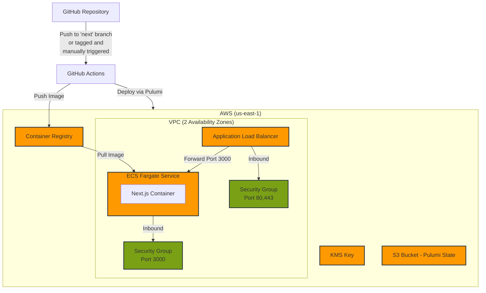

# UNTP Playground Deployment

## Environments

The UNTP Playground has two environments:

- **Test Environment**

  - URL: https://test.uncefact.org/test-untp-playground
  - Deployed when the repo owner is `uncefact` and either:
    - Pushes to the `next` branch or branches under the `cd/` prefix where code within `packages/untp-playground` has changed, or the [workflow file](../../../.github/workflows/ci_cd-untp-playground.yml) has changed, or
    - Manually trigger [workflow](../../../.github/workflows/ci_cd-untp-playground.yml)
  - Uses Pulumi stack: `test` (static - defined in workflow file)

- **Production Environment**
  - URL: https://test.uncefact.org/untp-playground
  - Deployed when:
    - Repo owner is `uncefact`
    - A new tag is created, associated with the next branch and the [workflow](../../../.github/workflows/ci_cd-untp-playground.yml) is triggered manually
  - Uses Pulumi stack: `prod`(static - defined in workflow file)

## Deployment Process

### Test Deployment

When code is pushed to the `next` or `cd/**` branch:

1. GitHub Actions workflow triggers automatically
2. Deploys with these environment variables (static - defined in [workflow file](../../../.github/workflows/ci_cd-untp-playground.yml)):
   - NEXT_PUBLIC_BASE_PATH = /test-untp-playground
   - NEXT_PUBLIC_ASSET_PREFIX = /test-untp-playground
   - NEXT_PUBLIC_IMAGE_PATH = /test-untp-playground/\_next/image

### Production Deployment

When a tag is created, associated with the next branch and the workflow is [triggered manually](https://github.com/uncefact/tests-untp/actions/workflows/ci_cd-untp-playground.yml):

1. GitHub Actions workflow triggers
2. Deploys with these environment variables (static - defined in [workflow file](../../../.github/workflows/ci_cd-untp-playground.yml)):
   - NEXT_PUBLIC_BASE_PATH = /untp-playground
   - NEXT_PUBLIC_ASSET_PREFIX = /untp-playground
   - NEXT_PUBLIC_IMAGE_PATH = /untp-playground/\_next/image

## Infrastructure Details

All deployments go to:

- AWS Region: us-east-1
- Architecture: Next.js app in Docker container
- Running on: AWS ECS Fargate
- Behind: Application Load Balancer with HTTPS enabled and CloudFront distribution, which is managed separately

## Access & Permissions

@kshychko is currently the only person with direct access to the UN AWS account where this application is deployed
Contact @kshychko for any AWS-related access needs or infrastructure changes

## Code Location

- Repository: [packages/untp-playground](../../../packages/untp-playground)
- Infra: [packages/untp-playground/infra](../../../packages/untp-playground/infra)
- Key workflow file: [.github/workflows/ci_cd-untp-playground.yml](../../../.github/workflows/ci_cd-untp-playground.yml)

## Important Notes

- Both environments currently share the same domain (test.uncefact.org) with different paths
- Production URL will change in the future (uncefact.org)
- [OIDC](https://docs.github.com/en/actions/security-for-github-actions/security-hardening-your-deployments/configuring-openid-connect-in-amazon-web-services) is configured to deploy the code to AWS account using GitHub workflows. AWS role to assume is handled via a stored [GitHub secret](https://github.com/uncefact/tests-untp/settings/secrets/actions) (UNCEFACT_AWS_ROLE_TO_ASSUME)
- The environment variables for base paths (NEXT_PUBLIC_BASE_PATH, NEXT_PUBLIC_ASSET_PREFIX, NEXT_PUBLIC_IMAGE_PATH) are required due to the CloudFront distribution setup
- Infrastructure is managed via [Pulumi](https://www.pulumi.com/)
- Pulumi security provider for config is set to AWS KMS.
- The same backend state bucket (S3) and KMS key are used for both test and production Pulumi stacks
- The production build is [configured using Docker image](https://nextjs.org/docs/pages/building-your-application/deploying#docker-image)
