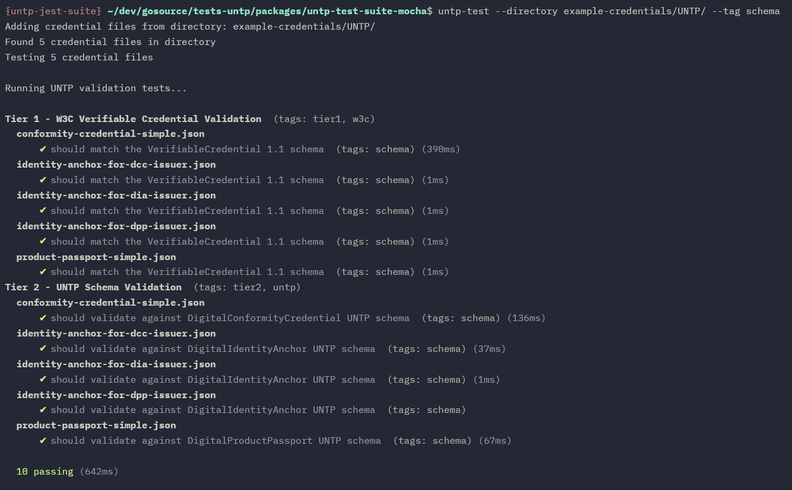

# UNTP Test Suite

A reusable testing library for United Nations Transparency Protocol (UNTP) credentials that works in both Node.js CLI and browser environments, using [Mocha](https://mochajs.org/).

Importantly, the same test runner is used in both environments for running the tests.

## Example CLI Usage



## Example Browser Usage


## Features

- **Both CLI and Browser Compatibility** - Same tests run in CLI and browser
- **Real-time Streaming Results** - Live test output with custom reporter
- **Tag-based Filtering** - Specific sets of tests can be selected using tags
- **Extension Schema Mapping** - Support for custom credential types with configurable mapping of extension type to schemas (both in CLI and browser)
- **General test extensibility** - TBD

## Testing Tiers

The package enables running the two tiers of UNTP validation that are currently available:

- **Tier 1**: W3C Verifiable Credential validation (JSON, JSON-LD, schema conformance)
- **Tier 2**: UNTP-specific credential type validation and required fields

Tier 3 testing will be added soon:
- **Tier 3**: Graph inference, trust-chain verification, and claim conformance

## Installation

```bash
npm install untp-test-suite-mocha
```

## CLI Usage

### Basic Usage

Test credential files directly or by passing a directory:

```bash
# Test single credential file
untp-test credential.json

# Test multiple files
untp-test credential1.json credential2.json credential3.json

# Test all credential files from directory
untp-test --directory ./credentials

# Combine individual files with directory scanning
untp-test credential.json --directory ./credentials

# With tag filtering
untp-test --directory ./credentials --tag tier1
```

**Supported file types**: `.json` and `.jsonld` files are automatically detected and included when scanning a directory.

### Extension Schema Mapping

Test credentials with custom extension types by providing schema mapping files:

```bash
# Test extension credential with custom schema mapping
untp-test --extension-schema-map example-credentials/extensions/digital-livestock-mapping.json  \\
example-credentials/extensions/DigitalLivestockPassport/digital-livestock-passport-simple-working-context.json

# Multiple extension mappings
untp-test --extension-schema-map ./ext1.json --extension-schema-map ./ext2.json credential.json

# Combine with directory scanning
untp-test --extension-schema-map example-credentials/extensions/digital-livestock-mapping.json  \\
--directory ./credentials
```

Extension mapping files define how to resolve schema URLs for custom credential types:

```json
{
  "version": "0.1.0",
  "mappings": [
    {
      "credentialType": "DigitalLivestockPassport",
      "schemaUrlPattern": "https://jargon.sh/user/aatp/DigitalLivestockPassport/v/working/artefacts/jsonSchemas/DigitalLivestockPassport.json?class=DigitalLivestockPassport"
    }
  ]
}
```

See [default-mappings.json](src/untp-test/schema-mapper/default-mappings.json) for an example showing the schema mapping used for UNTP credentials, or [digital-livestock-mapping.json](example-credentials/extensions/digital-livestock-mapping.json) for an example showing the mapping used for an example extension.

### Tag Filtering

Run only specific test types using tags:

```bash
# Run only Tier 1 tests
untp-test --tag tier1 credential.json

# Run only basic validation tests on directory
untp-test --tag basic --directory ./credentials

# Combine multiple tags
untp-test --tag tier1 --tag smoke --directory ./credentials

# Run validation and JSON-LD tests
untp-test --tag validation --tag jsonld credential.json
```

### Example Output

```
Testing 1 credential files

Running UNTP validation tests...

Tier 1 - W3C Verifiable Credential Validation  (tags: tier1, w3c)
    ✔ should have access to credential state  (tags: basic, integration)
  product-passport-simple.json
      ✔ should be a valid JSON-LD document  (tags: jsonld) (596ms)
      ✔ should match the VerifiableCredential 1.1 schema  (tags: schema) (126ms)
Tier 2 - UNTP Schema Validation  (tags: tier2, untp)
    ✔ should have access to credential state  (tags: basic, integration)
  product-passport-simple.json
      ✔ should validate against DigitalProductPassport UNTP schema  (tags: schema) (105ms)

  5 passing (835ms)
```

## Example Browser Usage

A small example browser test page has been generated that shows how you can run
the same tests with the same test runner, in a browser environment.

### Quick Start

1. Build the browser bundle:
```bash
npm run browser-test
```

2. Open `http://localhost:8080` in your browser

3. Upload credential files (.json or .jsonld) using drag & drop or file selection

4. Optionally upload extension schema mapping JSON files for custom credential types

5. Optionally add tags for filtering (e.g., `tier1`, `validation`, `smoke`)

6. Click "🚀 Run Tests" to see real-time results

Note that re-running tests uses the browser's cache automatically and so schemas are not re-fetched (and there's a [task](memory-bank/tasks/TASK006-persistent-http-cache.md) to
get the same behaviour on the CLI).

### Integration in Web Applications

Include the browser bundle in your web application:

```html
<!-- Load Mocha and dependencies -->
<script src="https://unpkg.com/mocha@10.2.0/mocha.js"></script>
<script src="https://unpkg.com/chai@4.3.10/chai.js"></script>

<!-- Load AJV for JSON schema validation -->
<script src="https://cdnjs.cloudflare.com/ajax/libs/ajv/8.17.1/ajv2020.bundle.min.js"></script>

<!-- Load JSON-LD for JSON-LD validation -->
<script src="https://unpkg.com/jsonld@8/dist/jsonld.min.js"></script>

<!-- Initialize Mocha -->
<script>mocha.setup('bdd');</script>

<!-- Load UNTP Test Suite -->
<script src="browser-bundle.js"></script>

<script>
// Set up credential data
const credentialData = new Map();
credentialData.set('credential.json', '{"@context": [...], "type": [...]}');
setCredentialData(credentialData);

// Run tests with extension schema mappings
const runner = new UNTPTestRunner();
const results = await runner.run({
  tags: ['tier1'], // Optional tag filtering
  extensionSchemaMaps: [extensionMappingObject], // Optional extension mappings
  mochaSetupCallback: (mochaOptions) => {
    const mocha = new Mocha(mochaOptions);
    mocha.cleanReferencesAfterRun(false);
    return mocha;
  }
}, (event) => {
  // Handle streaming test results
  console.log(`${event.type}:`, event.data);
});

console.log('Tests completed:', results.success ? 'PASSED' : 'FAILED');
</script>
```

See the [example browser-test](browser-test) for more info.

## Programmatic Usage

### Node.js

```typescript
import { UNTPTestRunner, setCredentialData } from 'untp-test-suite-mocha';
import * as fs from 'fs';

// Set up credential data
const credentialData = new Map();
const content = fs.readFileSync('credential.json', 'utf8');
credentialData.set('credential.json', content);
setCredentialData(credentialData);

// Run tests with extension schema mappings
const runner = new UNTPTestRunner();
const results = await runner.run({
  tags: ['tier1', 'validation'],
  extensionSchemaMaps: ['./extensions/custom-mappings.json'], // Optional extension mappings
  mochaSetupCallback: (mochaOptions) => {
    const Mocha = require('mocha');
    const mocha = new Mocha(mochaOptions);

    // Load test helpers
    require('./test-helpers');

    // Add test files
    mocha.addFile('./untp-tests/tier1/dummy.test.js');

    return mocha;
  }
}, (event) => {
  // Stream results in real-time
  if (event.type === 'pass') {
    console.log(`✔ ${event.data.title}`);
  } else if (event.type === 'fail') {
    console.log(`✖ ${event.data.title}`);
  }
});

console.log(`Tests: ${results.stats.passes} passed, ${results.stats.failures} failed`);
```

See the [CLI untp-test command](src/bin/untp-test.ts) for more info.

## Available Tags

Tests can include any `tag:tagname` in their title to enable filtering by that tag when running tests in both the CLI and web environments.

## Extension Testing

The test suite automatically validates credentials with extension types. When a credential contains custom types (like `DigitalLivestockPassport`) before the standard UNTP type, the suite will:

1. **Detect Extension Types**: Automatically identify extension types in the credential's type array
2. **Validate Against Extension Schemas**: Create individual tests for each extension type found
3. **Use Schema Mappings**: Resolve extension schema URLs using provided mapping files

### Example Extension Credential

```json
{
  "type": ["DigitalLivestockPassport", "DigitalProductPassport", "VerifiableCredential"],
  "@context": ["https://www.w3.org/ns/credentials/v2", "..."],
  "credentialSubject": { "...": "..." }
}
```

This credential will generate tests for:
- W3C VerifiableCredential validation (Tier 1)
- DigitalProductPassport UNTP schema validation (Tier 2)
- DigitalLivestockPassport extension schema validation (Tier 2)


### Custom Test Suites

For additional custom test logic, add your test files in the `mochaSetupCallback`:

```typescript
mochaSetupCallback: (mochaOptions) => {
  const mocha = new Mocha(mochaOptions);

  // Add built-in tests
  mocha.addFile('./untp-tests/tier1/basic.test.js');

  // Add your custom tests
  mocha.addFile('./my-tests/custom-validation.test.js');

  return mocha;
}
```

This will be exposed in the CLI at a later point.


## API Reference

### UNTPTestRunner

Main test execution class that works in both Node.js and browser environments.

#### `run(options, onStream?): Promise<UNTPTestResults>`

- **options**: `UNTPTestOptions` - Test configuration
- **onStream**: `(event: StreamEvent) => void` - Optional streaming callback to receive real-time events for test execution
- **returns**: `Promise<UNTPTestResults>` - Test execution results


### Building

```bash
# Build TypeScript
npm run build

# Build browser bundle
npm run build:browser

# Start development server
npm run browser-test
```

## License

MIT License - see LICENSE file for details.

## Related Projects

The following projects both within this repository are potential users of this new untp-test-suite:

- [UNTP Playground](../untp-playground) - Web interface for UNTP credential testing that I envisage will use this new untp-test-suite.
- [tests-untp E2E](../../e2e) - end to end test that is currently the only library using the existing untp-test-suite.
